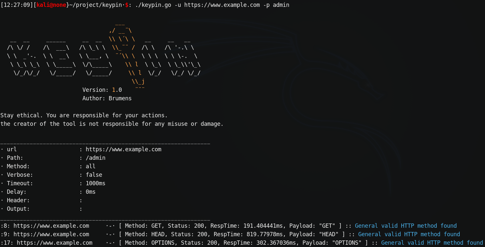

Keypin is a lightweight and highly customization tool, built to bypass forbidden pages. It supports the most common bypass techniques and also combined/adjust theses techniques for ore deep testing. 

---

# Features

* Friendly configuration and customaziation
* Supports diffirent techniques such as Verb, headers, path
* Adjust techniques depending on it's behavior for better detection 
* Bypass cached pages to avoid false negatives

---

# Installation

Using Golang
```
go get
```
Using Git

```
git clone https://github.com/Brum3ns/keypin.git
```


---

# Usage

Keypin help menu. Displays all options that are available.
```
./keypin -h
```
Simple bypass mode
```
./keypin -u https://www.example.com -p /admin
```
- ![#c5f015]>(+)`#c5f015` most effective and common way to test. This will run all default scans and combines techniques.

Attacking with custom Verb (HTTP method) and static header
[<b style="color:green">+</b>] Can be used if an early recon has been done and the user know that "X-Forward-For" is a valid supported header etc.
```
./keypin -u https://www.example.com -p /admin -H "X-Forward-For: 127.0.0.1" -m GET
```
Attacking a forbidden website on the root without a path given
[<b style="color:green">+</b>] If the root page is forbidden. This scan can be used to bypass the forbidden domain when no path is known.
```
./keypin -u https://www.example.com
```
Use for Debugging mode or to better detect response behavior from the target domain.
![#c5f015]>(+)`#c5f015`
```
./keypin -u https://www.example.com -p /admin -v
```
